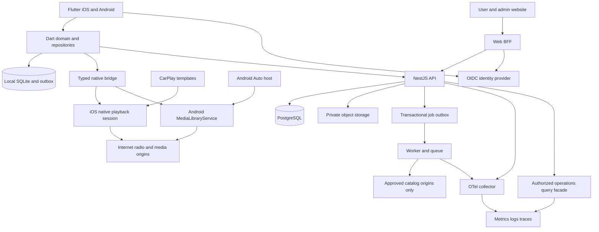

# Technical Architecture — Flutter, Connected Cars and Web Backend

Revision 0.2 · 2026-10-04 · **ผู้ใช้ยืนยัน scope: Flutter iOS/Android, CarPlay, Android Auto, วิทยุอินเทอร์เน็ต และ Backend เว็บมี Login/Settings/Monitoring/Logs**

ฉบับนี้แทน Swift-first / Apple-only / no-backend / CloudKit-only ใน revision 0.1. เป็นสเปกที่จะ implement ยังไม่มีแอปหรือบริการที่ deploy แล้ว

## 1. System boundary and stack

| Layer | Working choice | Responsibility |
|---|---|---|
| Mobile | Flutter + Dart | iOS/iPadOS และ Android phone/tablet; UI, domain, import, library, account, sync |
| iOS native | Swift + AVPlayer/AVAudioSession + MediaPlayer + CarPlay | playback session, background/remote controls, CarPlay templates |
| Android native | Kotlin + Media3 ExoPlayer + MediaLibraryService/MediaSession | service-owned playback, notification/audio focus, Android Auto browse/play |
| Bridge | Typed platform messages (Pigeon candidate) + versioned event stream | command/state/capability contract; no media bytes through Dart channel |
| Local storage | SQLite behind Dart repository; native browse snapshot | migrations/offline library/outbox; native session reads atomically published snapshot |
| Web portal | Next.js + TypeScript | responsive user portal + protected admin console; BFF for browser sessions |
| Backend API | NestJS + TypeScript, REST/OpenAPI | modular monolith: accounts, settings, devices, sync, radio catalog, billing, ops |
| Identity | OIDC provider, Keycloak working default | registration/login/email verification/reset/MFA/session management |
| Data | PostgreSQL | account-scoped metadata, config revisions, catalog, entitlements, audit outbox |
| Jobs | Worker + Redis/BullMQ candidate | catalog checks, notifications, cleanup, exports; DB outbox is durable source |
| Objects | S3-compatible private object storage | licensed artwork, exports, restricted diagnostic bundles |
| Observability | OpenTelemetry Collector + Prometheus/Grafana + Loki | server metrics/traces/redacted logs; app-admin views via authorized query facade |
| Delivery | Containers + managed DB where available | staging/production isolation, CI, secret manager, backup/restore |

Flutter เป็นข้อกำหนดสำหรับ mobile; เว็บใช้ Next.js เป็น working choice เพื่อให้ browser tables/forms/log search ใช้ DOM และ accessibility ได้ตรงไปตรงมา ไม่ต้องใช้ Flutter Web เพื่อแชร์ mobile UI. หากต้องการ Flutter Web ภายหลัง เปลี่ยน web adapter โดยรักษา API/BFF contract

Versions/Flutter packages/hosting vendor ยังไม่ lock: SP-01 และ SP-08 ต้องตรวจ support, license และ lifecycle ก่อน pin. iOS 17 และ Android 10/API 29 เป็น proposed minimum; target SDK เลือกตามข้อกำหนด store ณ release ไม่ถือว่าเป็นเลขเดียวกับ min SDK

## 2. Architecture overview



Backend เป็น control/data service สำหรับ account/config/catalog/operations ไม่เป็น media proxy/transcoder. ไม่มี remote play/stop บนรถจาก admin dashboard ใน R1; เปลี่ยน config ไม่ใช่สั่งอุปกรณ์เล่นเสียงเอง

## 3. Flutter and native ownership

Dart แชร์ models, parser, validation, use cases และ UI state แต่ **native session เป็นผู้ถือ playback state ที่มีผลจริง**. Dart ส่ง command และ subscribe snapshot; ห้ามสร้าง second player ใน Flutter audio plugin แยกจาก CarPlay/Android Auto session

- iOS app-scoped coordinator ถูกสร้างจาก native lifecycle ก่อน Flutter UI; CarPlay และ remote commands เรียก coordinator เดียวกัน
- Android service ถือ ExoPlayer/MediaSession; Flutter Activity เชื่อม controller ผ่าน bridge. รถต้อง browse และเริ่มเสียงได้เมื่อ Flutter Activity ไม่เปิด ไม่จำเป็นต้องรอ Dart UI engine
- Native browse snapshot เก็บ Favorites/Recent/Radio พร้อม opaque media IDs และ secure endpoint refs. Dart publish snapshot แบบ atomic; ไม่ให้ Dart/native เขียน SQLite schema เดียวกันแข่งกัน
- เมื่อเริ่ม service จาก cold process ใช้ last committed snapshot; source secrets resolve ผ่าน secure native store. หากยังไม่มี snapshot ให้รถแสดง “ตั้งค่าบนโทรศัพท์” ไม่ crash หรือเปิด Login ในรถ
- Native playback event journal ขนาดจำกัดส่ง recent/last state คืน repository เมื่อ reconnect; reconcile ด้วย sequence/session generation. Dart UI reattach ขอ full snapshot ก่อนรับ deltas
- Video surface บนมือถือผูกกับ session เดิมผ่าน platform view/texture adapter; engine ownership ไม่เปลี่ยนเมื่อ rotate/PiP/background
- CPU-heavy M3U/XMLTV parsing บน Dart isolate, DB writes ผ่าน single writer; serialization ไม่ส่ง 50k entries ผ่าน bridge ในเฟรมเดียว ให้ snapshot file/version + paged metadata

Flutter integration ใช้ platform channels ตาม [Flutter docs](https://docs.flutter.dev/platform-integration/platform-channels); native boundaries ข้างต้นเป็นการออกแบบของ TuneDeck ที่ยังต้องทำ spike

## 4. Internet radio and vehicle integrations

Radio หมายถึง **internet streaming ผ่าน Wi-Fi/cellular** ไม่ใช่ FM/AM tuner ในโทรศัพท์หรือการควบคุม hardware radio ของรถ. เป้าหมาย MP3/AAC/HLS, ICY metadata เมื่อ source/engine รองรับ, favorites/recent/search/category, bitrate label และ reconnect. ไม่มี network = browse cached catalog ได้แต่ฟังสดไม่ได้

CarPlay: public audio templates + entitlement/signing + native audio lifecycle. Android Auto: Android phone projected media experience, browse tree ผ่าน MediaLibraryService/MediaSession; ไม่ใช่ Android Automotive OS standalone app. AAOS และ Android TV ไม่อยู่ R1

Google ระบุ media library/session สำหรับ car integration และ service สำหรับ background media [Android car media](https://developer.android.com/training/cars/media), [background playback](https://developer.android.com/media/media3/session/background-playback). CarPlay ต้องขอ category entitlement [Apple](https://developer.apple.com/documentation/carplay/requesting-carplay-entitlements)

R1 ทั้งสองระบบรถเป็น audio; CarPlay video ยัง gated R2. Flutter ไม่ทำให้ web browser/video บนหน้าจอรถได้รับอนุญาตอัตโนมัติ รายละเอียด [09](09-CarPlay-Feasibility.md) และ [18](18-Android-Auto-and-Internet-Radio.md)

## 5. Backend modules and web surfaces

| Module | User portal | Admin console / worker |
|---|---|---|
| Identity & sessions | Login, profile, security, own sessions | invite/revoke staff, MFA status, access audit |
| Preferences & devices | language/theme/data policy, device sync status/revoke | config compatibility, delivery failures; no remote playback |
| Library metadata | favorites/order/source labels on own account | ไม่เปิดดู private library ให้ support โดย default |
| Internet radio catalog | discover cleared stations and favorites | CRUD draft/review/publish, rights ledger, health status |
| Diagnostics | opt-in, view/delete own uploaded report | redacted reports ตาม support scope |
| Operations | own sync/error status | API/worker/DB health, graphs, bounded log search, incidents |
| Billing | account-linked entitlement status | verified store events/reconciliation; no arbitrary paid toggle |
| Audit & privacy | data export/account deletion | access/change audit, retention/delete job status |

API ไม่เชื่อ `userId`/role จาก request body: derive actor จาก verified token และ enforce object ownership ทุก read/write. Admin scopes แยกจาก customer role; default deny. รายละเอียด login/RBAC/API ใน [17](17-Backend-Web-Console.md)

## 6. Login and offline behavior

เว็บทุก private route ต้อง Login. Mobile มี guest local mode; Login จำเป็นเมื่อ sync/settings ผ่านเว็บ. แยก guest/user namespaces; guest→account merge ต้อง preview/confirm. ไม่มี Login หรือ expired token ไม่ทำให้ public radio stream ที่กำลังเล่นอยู่หยุด

Mobile: OIDC Authorization Code + PKCE ผ่าน system browser; ไม่มี client secret ฝังในแอป; refresh credential เก็บ Keychain/Keystore-backed secure storage. Web: BFF เก็บ tokens server-side; browser มี Secure/HttpOnly/SameSite session cookie + CSRF defense. Staff ต้อง MFA; self-registration ไม่ได้สิทธิ์ staff

Backend outage: cached catalog/library/config + direct playback ทำงานต่อ; outbox retry แบบ bounded/backoff. Admin UI บอก stale/unavailable และไม่แสดง fake green. Login/ใหม่/remote changes unavailable จน service กลับมา

## 7. Cross-platform sync and settings precedence

เปลี่ยน CloudKit-only เป็น backend metadata sync สำหรับ iOS/Android/Web. R1 sync account preferences + catalog station favorites + device registry; imported playlist full metadata sync เป็น R1.1. ไม่ upload personal stream URL/auth headers โดย default; web จัด source labels ได้ แต่ private source endpoint ต้องตั้งในแต่ละ device จนมี secure transfer design

Order: hard platform/safety constraints → published application policy limits → device override ที่ allowlist อนุญาต → account preference → local defaults. Account theme/language ไม่ override CarPlay/Android Auto system appearance. Device preference ไม่ sync กลายเป็น global preference โดยไม่ได้ตั้งใจ

Remote config มี schemaVersion/revision/compatibility range, draft→validate→publish, If-Match concurrency, audit, expiry และ safe cached fallback. ใช้ configure/disable documented features เท่านั้น; ไม่ download executable behavior หรือซ่อนฟีเจอร์ตอน review. Clients รับ revision เมื่อ foreground/reconnect/periodic allowed window; ไม่สัญญา instant background delivery

## 8. Data, secrets and observability

Local primary metadata ใน SQLite; credentials จำนวนมากเก็บ encrypted secret blobs โดย key อยู่ Keychain/Keystore ไม่สร้าง Keychain item ทุกแถว 50k ช่อง. Server PostgreSQL เก็บ account metadata และ publisher-approved public catalog endpoints; private endpoints ไม่อยู่ server

Telemetry แบ่ง essential service logs, audit trail และ optional client diagnostics. ไม่มี source URL/token, playlist/channel title, email, IP หรือ listening history ใน operational event payload โดย default. Edge security IP ใช้เฉพาะ abuse defense retention สั้นและสิทธิ์เฉพาะตาม [17](17-Backend-Web-Console.md). Native crash/bridge logs ต้องผ่าน redaction ด้วย

Server sync state เป็น observed last-seen พร้อม timestamp ไม่ใช่ real-time location/กำลังฟังอะไร. Access to logs เป็น backend-enforced RBAC; browser ไม่ได้ Loki/DB credentials. Audit append-only สำหรับ app roles และแยก storage access จาก operational logs

## 9. Suggested monorepo (ยังไม่ได้สร้าง)

```text
apps/mobile/                 # Flutter UI + ios/Swift + android/Kotlin
apps/console/                # Next.js user/admin + BFF
services/api/                # NestJS modular monolith
services/worker/             # catalog checks / exports / deletion / store events
packages/dart_domain/        # models/use cases/parser policies
packages/dart_persistence/   # SQLite, migrations, outbox
packages/tunedeck_media/     # federated bridge interface + native implementations
packages/api_contracts/      # OpenAPI; generated Dart/TS clients
infra/                       # containers, environments, monitoring, IaC
fixtures/ tests/ Docs/
```

Dart และ TypeScript ไม่แชร์ executable business code โดยตรง; ใช้ schema/generated clients และ contract tests ร่วมกัน. Native Kotlin/Swift มี conformance fixtures เดียวกัน ไม่ต้อง replicate full library business logic

## 10. Invariants, limits and quality gates

หนึ่ง primary session ต่อ process; latest user intent/generation ชนะ. Flutter detach ไม่ destroy service; explicit pause ยกเลิก reconnect. Source imports atomic/cancellable; preview memory/network budgets เดิมยังใช้และต้อง remeasure บน Flutter ทั้งสอง OS

Initial limits: playlist ≤25MiB / line ≤64KiB / 50k entries; XMLTV compressed ≤20MiB / expanded ≤100MiB / 250k programmes; disk artwork 100MiB LRU. Endpoint checks ไม่ fetch user's private sources บน server. Published station checker จำกัด request/decode/redirect และ network egress ตาม backend spec

CI ต้องมี Dart tests/analyze, native Swift/Kotlin tests, bridge integration, API/RBAC/contract tests, web E2E และ physical-device background/car tests. Android/iOS minimum + current versions และ Android vendor battery management ต้องมี evidence

ก่อนรวม integration: SP-01 Flutter/toolchain + bridge, SP-02 dual engine, SP-03 CarPlay, SP-06 Android Auto cold start, SP-08 auth/backend isolation. ไม่มี plugin ไหนถือว่าผ่าน car/background support เพียงเพราะรองรับ Flutter audio

## 11. Deployment and cost

Dev containers/local fixtures → staging services/TestFlight/Play internal → production gradual rollout. TLS, private database/queue networks, server secret manager, separate signing/store identities, DB point-in-time recovery, encrypted backups และ restore drill

เริ่ม modular monolith + worker ไม่ใช้ microservices/Kubernetes จน scale มีเหตุผล. Redis/monitoring failure ไม่หยุด native playback; durable job outbox กู้ queue ได้. Web/API schema deploy แบบ backward compatible รองรับ mobile รุ่นก่อนตาม support window

Backend เพิ่มค่า DB/identity/monitoring/log storage/backup/egress/support เป็น recurring cost; โมเดลเดิมต้อง re-budget. Deployment vendor/region/domain และคนดูแลยังเป็น open decisions ไม่ได้ provision cloud ใดในงานนี้
