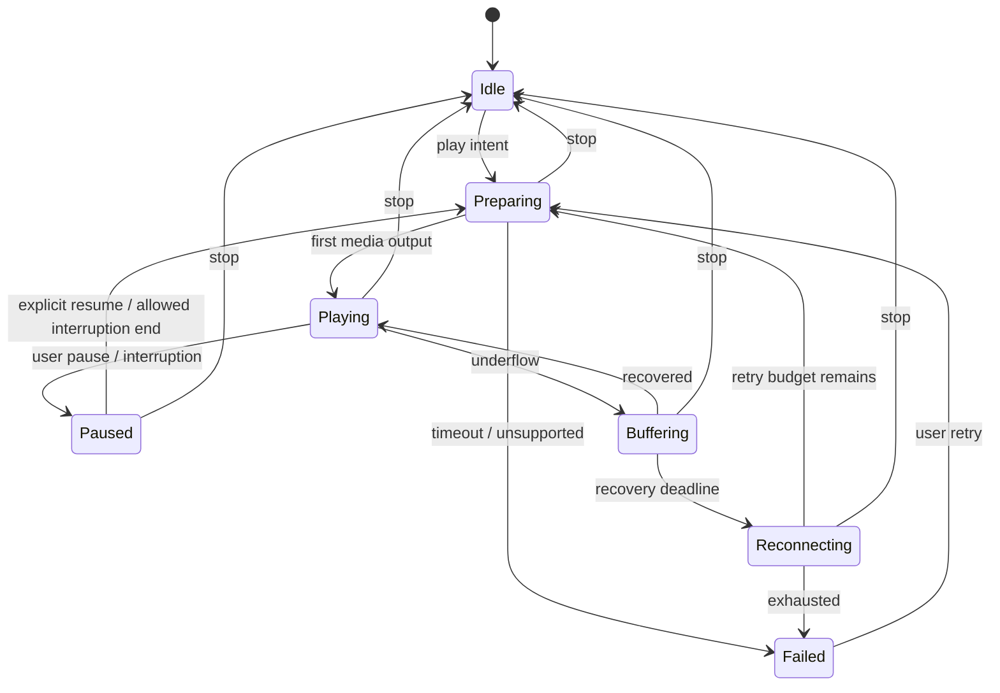

# Media Engine Specification

Owner: Flutter/native media lead · Design targets ต้องผ่าน SP-02 ก่อนใช้เป็น capability claim

## Support matrix

| Input | R1 intent | Notes / fallback |
|---|---|---|
| M3U/M3U8 playlist | Import | แยก HLS manifest ที่มี EXT-X tags จาก channel list |
| HTTPS HLS + H.264/AAC | Primary video/audio target | test actual codec/container/device |
| HTTPS AAC/MP3 radio | Primary audio target | verify ICY server variants ใน spike |
| HLS HEVC/HDR | Opportunistic device capability | ไม่สัญญารองรับทุก device; unsupported error ชัดเจน |
| Direct HTTPS MP4 | Secondary target | non-DRM, range/seek ตาม source |
| RTSP/RTMP/UDP/multicast/SMB | Not R1 | detect แล้วบอก unsupported, ไม่เปิด player ค้าง |
| DRM/provider websites | Not generic input support | ต้อง integration/สิทธิ์เฉพาะก่อน; ไม่มี DRM bypass |
| Local media files | R2 | R1 file import หมายถึง playlist ไม่ใช่ offline video library |
| AirPlay / PiP | System capability R1 | ไม่การันตีทุก source/route; real-device acceptance |
| DLNA receiver / VPN discovery | R2 research | ไม่มีใน R1 |

## M3U parsing

Streaming parser อ่าน UTF-8/BOM, LF/CRLF, blank lines/comments, EXTINF quoted attributes และ relative URLs ที่ resolve เทียบ playlist base URL. ห้ามแยกชื่อด้วย comma ทุกตัว: ใช้ comma delimiter หลัง attribute quotes เท่านั้น

รู้จัก tvg-id/tvg-name/tvg-logo/group-title; unknown attributes เก็บเฉพาะ allowlist diagnostic count ไม่รันเป็น code. EXTINF ไม่มี URI ถัดไป → invalid row. URI ที่ไม่มี EXTINF → สร้างชื่อจาก host/path ที่ sanitize แล้วหรือให้ผู้ใช้ตั้ง ไม่แสดง token

Detect EXT-X-TARGETDURATION/STREAM-INF ว่าเป็น HLS media/master manifest → เสนอเพิ่ม direct channel ไม่แตก segments เป็นรายการช่อง. Relative file refs นอก security-scoped selection ไม่อ่านต่อเอง

Preview รายงาน valid/invalid/duplicate counts โดย counts รวมกันได้กับ candidate count; warning counts แยกไม่บวกเป็นรายการเพิ่ม. Limits ตาม architecture; cap parser errors แสดง 100 ตัวอย่าง + total count ป้องกัน UI/memory ระเบิด

## XMLTV / EPG

R1 กำหนด EPG source เดียวต่อ playlist, XML/optional gzip ตาม limits. Streaming XML parser ปิด external entity/DTD expansion. เก็บ programme UTC จาก explicit offset; timestamp ไม่มี timezone ให้ผู้ใช้เลือก source timezone ก่อนใช้ ไม่ assume device timezone

Mapping: explicit manual mapping → exact tvg-id → exact normalized name ที่ unique ใน source; ambiguous ไม่ auto-match. Programme overlap แสดง deterministic latest-start match พร้อม diagnostic; malformed end/start skip; ตอนจบใช้ interval [start,end)

Fetch window เป้าหมาย yesterday ถึง 7 วันหน้า; refresh TTL 6 ชั่วโมงเมื่อแอปมีโอกาสทำงาน ไม่สัญญา background job ตรงเวลา; cached guide ใช้ได้พร้อม stale badge. ห้ามแปล programme titles อัตโนมัติใน R1

## Playback state machine

Stop/cancel ใช้ได้จากทุก state รวม Failed; diagram ย่อ transitions เพื่อให้อ่านง่าย. Latest session generation เป็นตัวตัดสิน callback validity. User pause ต้องยกเลิก retry/autoresume pending

Default retry: สูงสุด 3 reconnect attempts ที่ delay 1s/2s/4s + jitter ภายใน 30s หลัง failure; auth/unsupported ไม่ retry. Network restored ใช้ budget เดิม ไม่ reset ไม่จำกัด. หมด budget ให้ manual Retry. Startup timeout 15s เป็น hard stop ไม่ใช่ latency target

## Audio lifecycle

Audio session และ Now Playing metadata อัปเดตจาก coordinator เดียว. รองรับ lock screen, remote play/pause/next/previous และ call/navigation interruption. Resume ได้เมื่อระบบอนุญาตและ intent ก่อน interruption คือ playing; user pause ระหว่างนั้นต้องชนะ

Headphone/Bluetooth/CarPlay/Android Auto disconnect ถ้า output เปลี่ยนเป็น speaker ให้ pause; ไม่ส่งเสียงเอง. Background video ปิดภาพตาม lifecycle และเล่นเสียงต่อเฉพาะ source/session ที่อนุญาต; PiP transition ไม่สร้าง player ใหม่ซ้ำ

ICY metadata เป็น optional capability: หาก parser/platform ส่ง metadata ไม่ได้ ให้ชื่อสถานีคงที่; อย่าอ้างมี song title ทุกสถานี. ทำ spike แยก proxyless metadata path ก่อนเพิ่ม custom decoder

## Performance/bandwidth

Adaptive buffer ตาม source/network; “pre-buffer 20s” ไม่ใช่ guarantee เพราะ live server อาจไม่มีข้อมูลอนาคตและ latency จะเพิ่ม. แสดง stalled indicator หลัง 1s โดยไม่ block controls. Preview ปิดบน cellular โดย default, เปิดทีละหนึ่ง, หยุดเมื่อ scroll offscreen/primary plays/thermal serious

ไม่มีการ download เพื่อ offline หรือ record stream ใน R1. Artwork fetch resize/downsample + cache limits; memory warnings purge preview/artwork ก่อน primary session. Health check เฉพาะรายการที่ผู้ใช้เลือก ไม่ ping 50k streams พร้อมกัน

## Required fixtures

M3U valid/invalid/Unicode/duplicate/relative/oversize; HLS master/media confusion; XMLTV offset/DST/no timezone/overlap/entity attack; audio metadata absent/change; 401/403/404/429/timeout; codec unsupported; switching 20 channels rapidly; reconnect Wi-Fi↔cellular. Fixture content ต้อง synthetic หรือมี rights record

## Revision 0.2 — dual native engines

Flutter ใช้ AVPlayer adapter บน iOS และ Media3/ExoPlayer adapter บน Android; state machine ด้านบนเป็น shared behavioral contract ที่ native owners implement และทดสอบด้วย fixtures เดียวกัน. Codec/DRM/ICY/PiP support ต้องรายงานแยก OS ไม่ assume ว่า plugin API เดียวแปลว่า capability เท่ากัน

Radio เป็น internet audio; service/background/snapshot/data policy และ Android Auto specified ใน [18](18-Android-Auto-and-Internet-Radio.md). Cloud health checker ตรวจเฉพาะ approved public catalog ตาม [17](17-Backend-Web-Console.md); ไม่ scan user library บน server. Backend outage ไม่ยุติ direct stream
